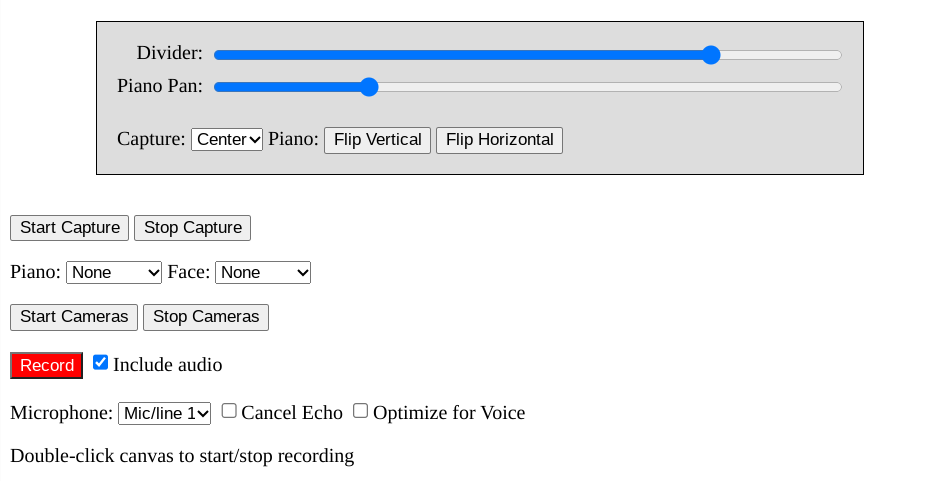

# vps
Visual Piano Studio

Visual Piano Studio allows you to easily create a screen layout
that shows your computer screen to display sheet music,
a webcam to show your face,
and an external camera to show the piano keys.
You can use any two of these together, or all three.
Rather than provide an overwhelming variety of options
to create unlimited different layouts,
it just makes it simple to create ones that works well
for piano teachers and students.

## Usage

To use this app, just point your browser at
https://marcsabatella.github.io/vps

You'll see a mostly empty window with a suggestion to scroll down for the controls.
Those controls allows you to start and stop the screen capture and to select, start, and stop the cameras.

You can also adjust the size and position of the screen capture relative to the piano camera
and the cropping of the piano camera view.
The face camera will automatically size and position itself to fit alongside the screen capture.
Note that if you change the size of the screen capture,
you may need to re-start the face camera.

After setting up your layout, scroll back up.
Your settings are remembered the next time you run the app.

You can then screen share this browser tab in your favorite video tool,
such as Screencastify or Zoom,
oo create videos or live streams that show your screen and camera layout.
By sharing just a specific window or browser tab,
you can then switch to the whatever other app you wish to actually display as the screen capture.
Your viewers will see the full Visual Piano Studio layout, including the screen capture and the camera view,
while you work in the other app.

For a demonstration, see https://youtu.be/uqfP7VZL2fs and https://youtu.be/nmZQ4Avut_A

I recommend running the app without selecting any audio options,
unless you are comfortable working through the details of how to avoid feedback.
I normally either let sound play through a speaker and use a microphone to pick it up,
or I use a mixer with "loopback" capability to create a more sophisticated routing.
Visual Piano Studio provides additional options to control enable echo cancellation and other audio processing
if you do choose to share the audio from the app.

## Screenshots

### In use

### Controls

